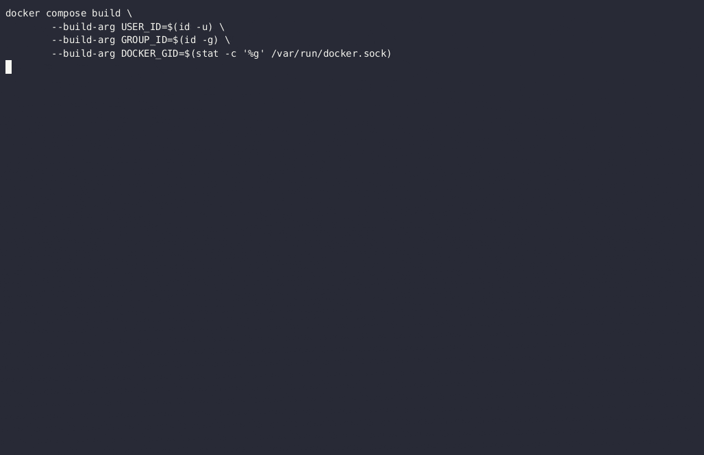

# labgrid QEMU Sample

This repository demonstrates the use of [pytest](https://pytest.org/) and [labgrid](https://labgrid.readthedocs.io) for interacting with a QEMU virtual machine (VM) running the OpenWrt firmware.

Utilizing pytest and labgrid simplifies the creation of complex test scenarios, ensuring the reliable and efficient operation of the system under test with minimal code (i.e. less than 500 lines of Python code).

The controlled virtual testing environment enhances both accuracy and reliability of the firmare under test, providing a scalable solution for continuous integration and quality assurance in embedded systems.

## Overview

Our goal is to validate the ability of OpenWrt to establish an OpenVPN connection using a server hosted in a standalone Docker Compose environment which is set up in the course of the test execution process as well.

**Test steps**:

1. Boot the Firmware
2. Set up SSH access to the OpenWrt firmware
3. Generate PKI (CA + server/client certs)
4. Start dedicated docker compose environment with the OpenVPN server
5. Update list of packages in OpenWrt
6. Install OpenVPN client in OpenWrt
7. Set up OpenVPN client in OpenWrt
8. Configure firewall in OpenWrt
9. Verify the OpenVPN tunnel has been established successfully

## Architecture Overview

This section outlines the architecture implemented for the pytest/labgrid demonstration:


The system is initiated by utilizing GNU Make, which starts a Docker Compose setup. This environment runs both the tests based on the pytest/labgrid test framework and QEMU, the latter serving as the execution environment for the firmware under test. As part of the test fixtures, a Public Key Infrastructure (PKI) is generated. This PKI includes the key material necessary for the OpenVPN server, and it is provided to the OpenVPN server as its Docker Compose environment is started.

During the test execution phase, the test scripts configure the firmware to establish a connection with the OpenVPN server. This involves transferring the key material specific to the firmware under test. In the verification phase, the test script first pings the OpenVPN server from the firmware within the Docker Compose environment. Subsequently, it verifies connectivity in the reverse direction by pinging the firmware from within the OpenVPN server. This process ensures proper communication and confirms that the OpenVPN client in the firmware works as designed.

## Requirements

- Linux Host
- Docker Engine + Docker Compose (see [Installation Instructions](https://docs.docker.com/engine/install/debian/))
- GNU Make

## Setup Instructions

1. **Clone the repository**:

``` shell
git clone https://github.com/honeytreelabs/labgrid-qemu-sample.git
cd labgrid-qemu-sample
```

2. **Prepare the Environment:**

Ensure all the necessary dependencies are met on your host machine.
   
3. **Running Tests**:

```shell
make test-docker
```

## Demo

This is what you should see when running this sample:


